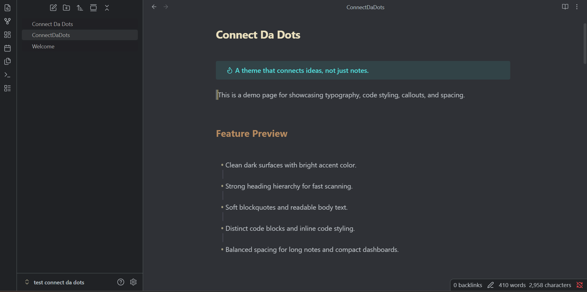
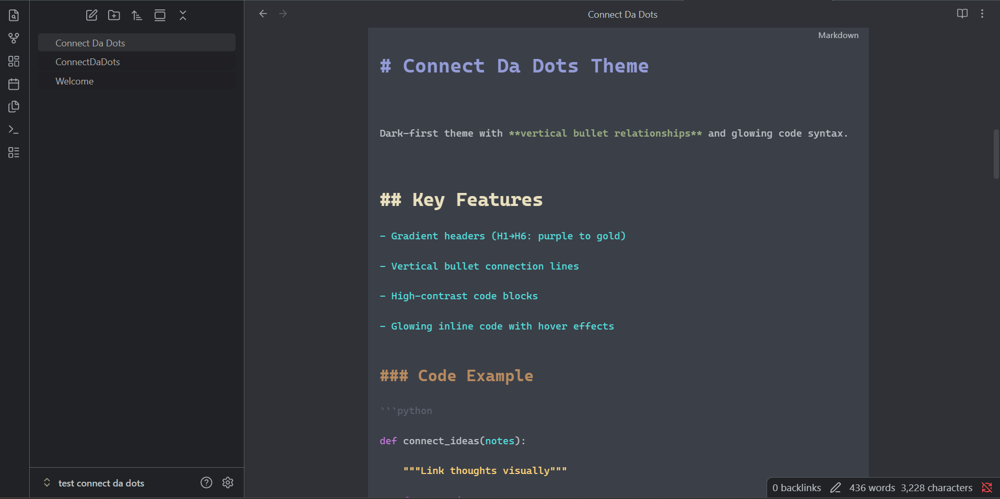

# 🔗 Connect Da Dots — Dark Obsidian Theme

> **See your notes connect.** Vertical bullet relationship lines. Glowing inline code. A dark theme that makes outlines actually readable.

<div align="center">
  
</div>

## 🔍 Feature Deep Dive

### 1. Vertical bullet lines (the main hook)

<div align="center">
  
</div>

- **Editing mode** – Lines appear as you type, aligned with each indent level.
- **Reading mode** – Clean, consistent lines that don't overlap.

### 2. Code blocks that don't hurt your eyes

<div align="center">
  
</div>

## ✨ Why this theme?

Most Obsidian themes treat lists as flat text. **Connect Da Dots** draws **vertical relationship lines** between parent bullets and their children – so you can visually trace connections in your outlines, meeting notes, or code docs.

- 🔗 **Vertical bullet lines** – Watch lines grow as you nest ideas (Editing + Reading modes)
- 🎨 **Gradient headers** – H1 (cool purple) → H6 (muted teal) gives instant hierarchy
- 💻 **Code that pops** – High-contrast dark blocks + syntax highlighting (Python, JS, etc.)
- ✨ **Glowing inline code** – Subtle hover glow makes `code` feel interactive
- 🎛️ **Fully customizable** – Tweak colors, line thickness, glow intensity right inside Obsidian Settings

---

## 📦 Installation

### From Obsidian Community Themes (coming soon)
1. Go to `Settings → Appearance → Themes → Manage`
2. Search **"Connect Da Dots"**
3. Click **Use** – done.

### Manual install (for now)
1. Download `theme.css` and `manifest.json`
2. Copy them into your vault:  
   `.obsidian/themes/Connect Da Dots/`
3. Enable in `Settings → Appearance → Themes`

> ⚠️ **Dark mode only.** Light mode isn't supported (but PRs are welcome).

---

## 🎨 Customization (No CSS needed)

This theme exposes **20+ settings** via Obsidian’s native theme settings panel.

Go to `Settings → Theme → Connect Da Dots` to tweak:

| Category | What you can change |
|----------|---------------------|
| **Bullet & Indent Lines** | Line color, thickness, bullet point color |
| **Header Colors** | Each heading level (H1–H6) independently |
| **Inline Code Colors** | Text + background, editor vs reading mode |
| **Hover Glow** | Color + intensity (from subtle to WOW) |

No `!important` hacking required. All variables are built into the theme.

---

## 🔍 Feature Deep Dive

### 1. Vertical bullet lines (the main hook)

- **Editing mode** – Lines appear as you type, aligned with each indent level.
- **Reading mode** – Clean, consistent lines that don’t overlap.
- **Works best at 2–3 nesting levels** (beyond that, Obsidian’s dynamic indentation can cause slight misalignment – but the relationship is still clear).

### 2. Code blocks that don’t hurt your eyes

- Background: `#0b0d10` (deep void)
- Text: `#e5e9f0` (soft white)
- Syntax tokens:  
  `#c678dd` (keywords) · `#ffd479` (strings) · `#9aedfe` (numbers) · `#7ee787` (functions)

Inline code has a **glow on hover** – configurable intensity.

### 3. Headers that guide

| Level | Color (hex) | Size |
|-------|-------------|------|
| H1    | `#939bd6`   | 28px |
| H2    | `#EAE0BE`   | 26px |
| H3    | `#b78b60`   | 23px |
| H4    | `#a79645`   | 20px |
| H5    | `#859676`   | 18px |
| H6    | `#799097`   | 16px |

All bold, all readable even on small screens.

---

## 🐛 Known Limitations (transparent dev notes)

- **Nested bullet lines** – At 4+ levels, lines may shift slightly due to Obsidian’s dynamic indentation. Still usable, not pixel-perfect.
- **Light mode** – Not supported. (I’m a dark theme person – sorry.)
- **Reading mode code syntax** – Requires you to specify language after backticks (e.g. ` ```python `). Works flawlessly if you do.

I chose to ship this as a **v1.0** because it’s already useful for 90% of use cases. Future versions may improve deep nesting.

---

## 🤝 Contributing

Found a bug? Open an issue.  
Want to add light mode or better 4-level lines? PRs are welcome.

**Repo:** [github.com/Kevork-Nexacrawl-dev/obsidian-connect-da-dots](https://github.com/Kevork-Nexacrawl-dev/obsidian-connect-da-dots)

---

## 📄 License

MIT – free to use, modify, share, or sell. Just don’t claim you wrote it from scratch.

---

## 🙏 Why I built this

I’m a developer without a degree, building a GitHub portfolio that speaks louder than a diploma.  
This theme is my way of solving a real problem (visualizing note relationships) while shipping production-quality CSS to thousands of users.

If you like it, **star the repo** – it helps more than you know.

---
